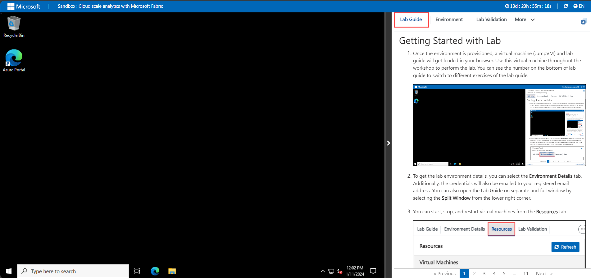
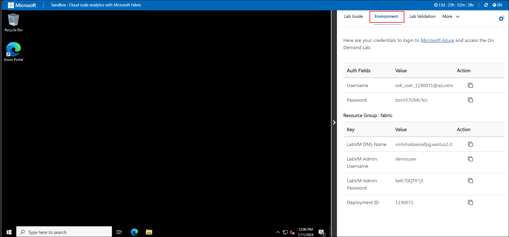
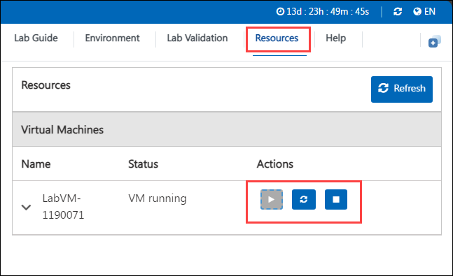
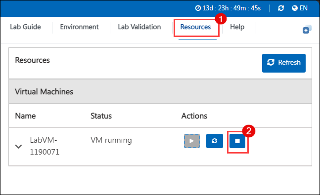
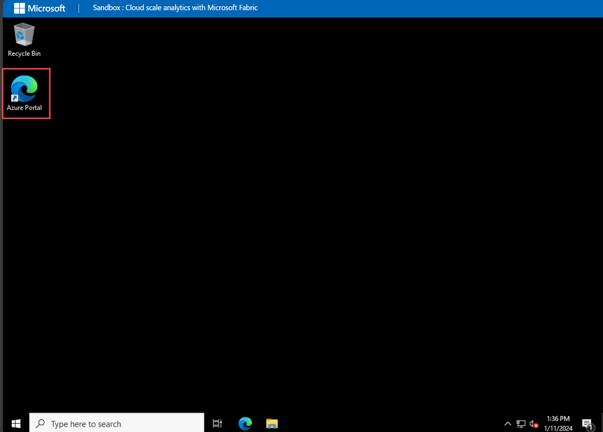

# Getting Started with Cloud scale analytics with Microsoft fabric

  ## Accessing Your Lab Environment
 
   Once you're ready to dive in, your virtual machine and lab guide will be right at your fingertips within your web browser.

   

  ### Virtual Machine & Lab Guide
 
   Your virtual machine is your workhorse throughout the workshop. The lab guide is your roadmap to success.
 
  ## Exploring Your Lab Resources
 
   To get a better understanding of your lab resources and credentials, navigate to the **Environment Details** tab.

   

   ## Utilizing the Split Window Feature
 
   For convenience, you can open the lab guide in a separate window by selecting the **Split Window** button from the top right corner.

   ## Managing Your Virtual Machine
 
   Feel free to start, stop, or restart your virtual machine as needed from the **Resources** tab. Your experience is in your hands!

   You can start, stop, and restart virtual machines from the **Resources** tab.

   
 
  > You will see the DeploymentID value on **Environment Details** tab, use it wherever you see SUFFIX or DeploymentID in lab steps.

   Ensure the timely deallocation of virtual machines from the **Resources tab**. When they are not actively in use, aiming to minimize costs.

   

   ## **Lab Duration Extension**

1. To extend the duration of the lab, kindly click the **Hourglass** icon in the top right corner of the lab environment. 

   

    >**Note:** You will get the **Hourglass** icon when 10 minutes are remaining in the lab.

2. Click **OK** to extend your lab duration.
 
     

3. If you have not extended the duration prior to when the lab is about to end, a pop-up will appear, giving you the option to extend. Click **OK** to proceed.

## Login to Azure Portal

1. In the JumpVM, click on Azure portal shortcut of Microsoft Edge browser which is created on desktop.

   
   
1. On **Sign into Microsoft Azure** tab you will see login screen, in that enter following email/username and then click on **Next**. 
   * Email/Username: <inject key="AzureAdUserEmail"></inject>
   
   
     
1. Now enter the following password and click on **Sign in**.
   * Password: <inject key="AzureAdUserPassword"></inject>
   
   
     
   > If you see the pop-up click on **ask later**.

   
  
1. If you see the pop-up **Stay Signed in?**, click No

1. If you see the pop-up **You have free Azure Advisor recommendations!**, close the window to continue the lab.

1. If a **Welcome to Microsoft Azure** popup window appears, click **Maybe Later** to skip the tour.
      
1. Now, click on the **Next** from lower right corner to move on next page, this helps you to move to the instruction page of each exercises.
