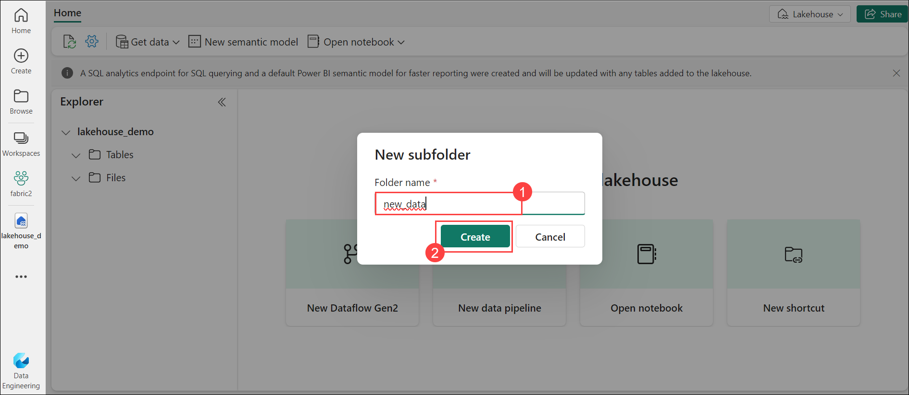
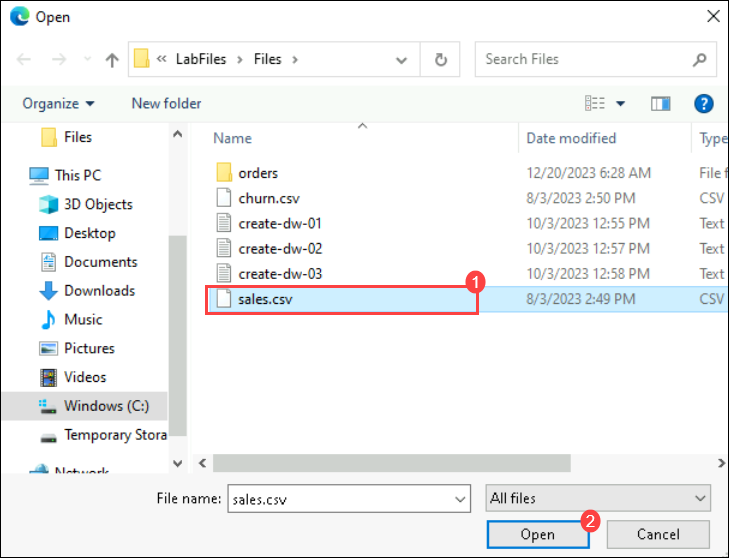
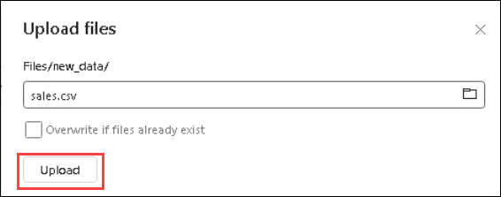

# Lab 01: Getting Started with Microsoft Fabric

## Lab Objectives

Exercise 1 : Create a Fabric workspace.<br>
Task 1.1: Assign Fabric Administrator Role.<br>
Task 1.2: Create a workspace.<br>

Excerise 2 : Create a Lakehouse and upload files.<br>
Task 2.1 : Create a lakehouse.<br>
Task 2.2 : Upload files .<br>


### Estimated timing: 60 minutes

## Architecture Diagram 

   

## Exercise 1 : Create a Fabric workspace

#### Task 1.1: Assign Fabric Administrator Role

1. Start by searching for **Microsoft Entra ID** in the search pane in Azure portal:

    

2. Navigate to **Roles and administrators**:

    

3. In the **Roles and administrators** page, search for **Fabric Administrator**, and click on it:

    

4. This will take you to the **Fabric Administrator | Assignments** page where you will have to assign yourself the **Fabric Administrator role**. Now, click on **+ Add Assignments**:

    

5. Make sure to **check the box(1)** next to your username, confirm if it is **Selected(2)** and click on **Add(3)**:

    

6. You can confirm the **Fabric Administrator** role has been added successfully by **refreshing(1)** Fabric Administrators | Assignments page. After **confirming(2)** it has been added successfully, navigate back to **Home(3)**.

    

----


#### Task 1.2: Create a workspace

1. Copy the **microsoft fabric homepage link**, and open this link inside the VM in a new tab:

   ```
   https://app.fabric.microsoft.com/
   ```


2. Select **Power BI**.

    
   


3.  Now, select **Workspaces** and click on **+ New workspace**:

     

4. Fill out the **Create a workspace** form with the following details:

   - **Name:** Enter **fabric-<inject key="DeploymentID" enableCopy="false"/>**.
   

    

   - **Advanced:** Expand it and Under **License mode**, select **Fabric capacity(1)**.

5. Select on exisitng **Capacity(2)** then click on **Apply(3)** to create and open the workspace.

    

## Excerise 2 : Create a Lakehouse and upload files.
   

## Task 2.1 : Create a lakehouse.

1. At the bottom left of the Power BI portal, select the **Power BI** icon and switch to the **Data Engineering** experience.

    
   
2. In the **Data engineering** home page, create a new **Lakehouse**.

    - **Name:** Enter **Lakehouse_<inject key="DeploymentID" enableCopy="false"/>**.

    

    After a minute or so, a new lakehouse with no **Tables** or **Files** will be created.

### Task 2.2: Upload files 

 1. On the **Lake view** tab in the pane on the left, in the **...** menu for the **Files** node, select **New subfolder** and create a subfolder named **new_data**.

    

2. Under Upload choose **Upload files**.
   
    
   
3. Browse the path **C:\LabFiles\Files** and select the file **sales.csv**. 

    

4. Click on **Upload**

    

5. In the menu bar on the left, select your lakehouse.

6 On the **Home** page, in the **Lakehouse explorer** pane, expand **Files** and select the **new_data** folder to verify that the **sales.csv** file has been copied.

   
  
   ## Review

   In this Lab , a Fabric workspace was created, starting with the assignment of the Fabric Administrator Role for administrative privileges. Subsequently, a workspace was successfully 
  created , the process continued with the creation of a Lakehouse to serve as a centralized data repository. Files were then uploaded into the Lakehouse , establishing the foundation 
  for subsequent data processing and analysis.


  ## Proceed to next exercise
