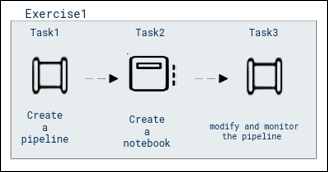
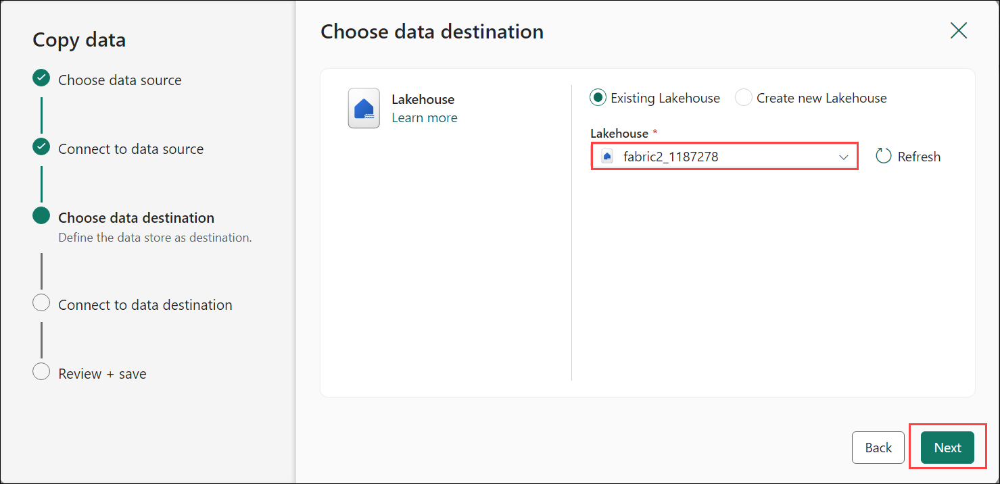
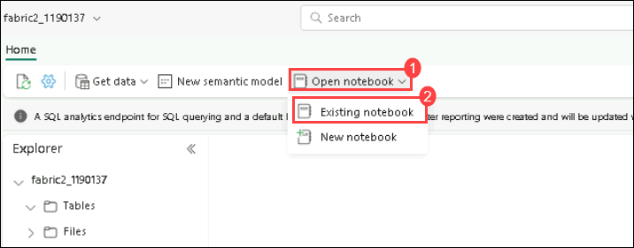
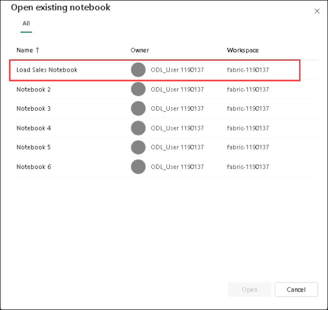
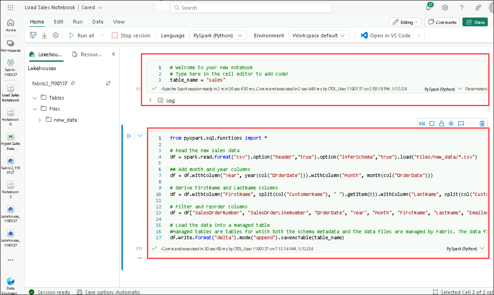
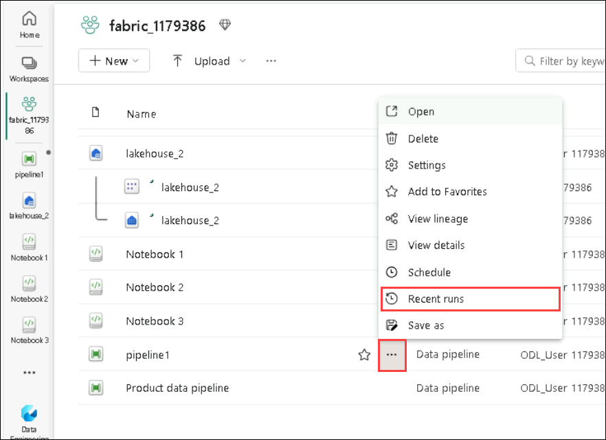
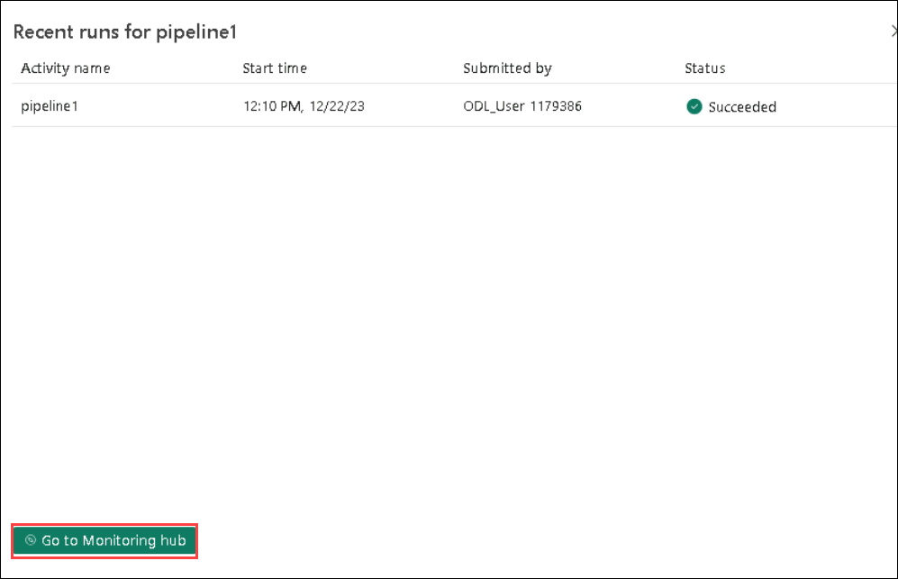
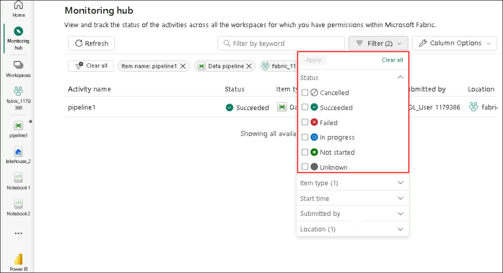
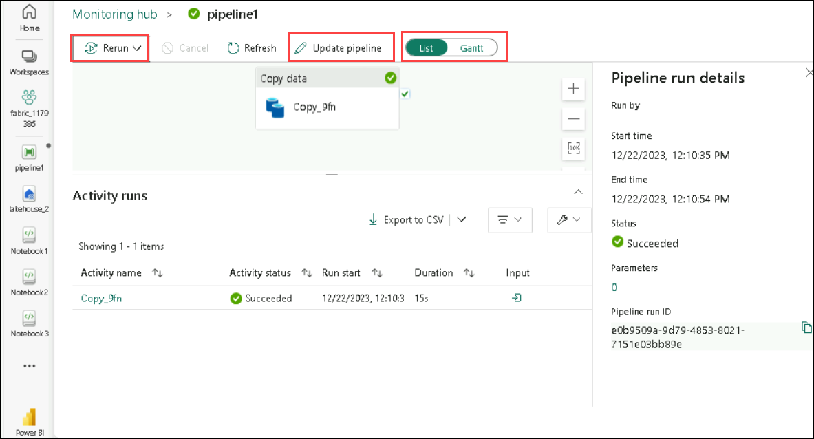

# Lab 05: Seamless Cloud Analytics: Empowering with Data Pipelines

## Lab Overview

In this lab, you will immerse yourself in the world of cloud-scale analytics, leveraging Microsoft Fabric to orchestrate data pipelines and analyze information seamlessly.

## Lab Objectives

Task 1 : Create a pipeline 
Task 2 : Load a notebook 
Task 3 : Modify and Monitor the pipeline 

  
### Estimated timing: 40 minutes

## Architecture Diagram

## Task 1 :  Create a pipeline

A simple way to ingest data is to use a **Copy Data** activity in a pipeline to extract the data from a source and copy it to a file in the lakehouse.

1. At the bottom left of the Power BI portal, select the **Power BI** icon and switch to the **Data Engineering** experience.

1. In the **Synapse Data Engineering** home page, create a new **Lakehouse**.

   - **Name:** Enter **fabric2_<inject key="DeploymentID" enableCopy="false"/>**

1. On the **Home** page for your lakehouse, select **New Data pipeline**.

     

1. Create a new data pipeline named **Ingest Sales Data Pipeline**. 
   
     
   
1. If the **Copy Data** wizard doesn't open automatically, select **Copy Data** in the pipeline editor page.

     

1. In the **Copy Data** wizard, on the **Choose a data source** page, in the **data sources** section, select the **Generic protocol (1)** tab and then select **HTTP (2)**, click on **Next (3)**.

     

1. Select **Next** and then select **Create new connection** and enter the following settings for the connection to your data source:
    - **URL**: `https://raw.githubusercontent.com/MicrosoftLearning/dp-data/main/sales.csv`
    - **Connection**: Create new connection
    - **Connection name**: **github**
    - **Authentication kind**: Basic (*Leave the username and password blank*)
  
     
    
1. Select **Next**. Then ensure the following settings are selected:
    - **Relative URL**: *Leave blank*
    - **Request method**: GET
    - **Additional headers**: *Leave blank*
    - **Binary copy**: <u>Un</u>selected
    - **Request timeout**: *Leave blank*
    - **Max concurrent connections**: *Leave blank*
  
     
   
1. Select **Next**, and wait for the data to be sampled and then ensure that the following settings are selected:
    - **File format**: DelimitedText
    - **Column delimiter**: Comma (,)
    - **Row delimiter**: Line feed (\n)
    - **First row as header**: Selected
    - **Compression type**: Leave default
1. Select **Preview data** to see a sample of the data that will be ingested. Then close the data preview and select **Next**.

     

1. On the **Choose data destination** page, select your existing lakehouse. Then select **Next**.

     

     

1. Set the following data destination options, and then select **Next**:
    - **Root folder**: Files
    - **Folder path name**: new_data
    - **File name**: sales.csv
    - **Copy behavior**: Leave default
   
     

1. Set the following file format options and then select **Next**:
    - **File format**: DelimitedText
    - **Column delimiter**: Comma (,)
    - **Row delimiter**: Line feed (\n)
    - **Add header to file**: Selected
    - **Compression type**: Leave default
   
     

1. On the **Copy summary** page, review the details of your copy operation and then select **Review + Run**.

    A new pipeline containing a **Copy Data** activity is created, as shown here:

     

1. When the pipeline starts to run, you can monitor its status in the **Output** pane under the pipeline designer. Use the **&#8635;** (*Refresh*) icon to refresh the status, and wait until it has succeeded.

     

1. In the menu bar on the left, select your lakehouse.

1. On the **Home** page, in the **Lakehouse explorer** pane, expand **Files** and select the **new_data** folder to verify that the **sales.csv** file has been copied.

     

 ## Task 2 : Load a notebook

1. On the **Home** page for your lakehouse, in the **Open notebook** menu, select **Existing notebook**.

      

    After a few seconds, a exisitng notebook containing a single *cell* will open. Notebooks are made up of one or more cells that can contain *code* or *markdown* (formatted text).

2. Choose **load sales Notebook** from the list .

      

3. Select the existing cell in the notebook, which contains some simple code, and then rerun the code with the following as shown in the screenshot below:
   
      

4. In the hub menu bar on the left, select your lakehouse.

5. In the **Explorer** pane, refresh the view. Then expand **Tables**, and select the **sales** table to see a preview of the data it contains.

  ## Task 3 :  Modify and Monitor the pipeline

1. To monitor your data pipeline runs, hover over your pipeline in your workspace. Doing so will bring up three dots to the right of your pipeline name.

    
   
1. Select the three dots to find a list of options. Then select View run history. This action opens a fly-out on the right side of your screen with all your recent runs and run statuses.

1. Select Go to monitoring hub from the prior screenshot to view more details and filter results. Use the filter to find specific data pipeline runs based on several criteria.

    

1. Select one of your pipeline runs to view detailed information. You’ll be able to view what your pipeline looks like and view more properties like Run ID or errors if your pipeline run failed.

    

1. You can select Update pipeline to make changes to your pipeline from this screen. This selection will take you back in the pipeline canvas.

1. You can also Rerun your data pipeline. You can choose to rerun the entire pipeline or only rerun the pipeline from the failed activity.

1. A Gantt chart is a view that lets you see the run history over a time range. If you switch to a Gantt view, all pipeline runs will be grouped by name, displayed as bars relative to 
  how long the run took.

    

## Review

In this exercise, the completion of these tasks involved the creation of a pipeline for orchestrating data workflows. A notebook was created to execute specific tasks within the pipeline. Furthermore, the pipeline was modified and monitored to ensure adaptability and to track its performance over time. The tasks collectively contributed to the development and management of an effective data processing infrastructure.

## Proceed to next exercise

